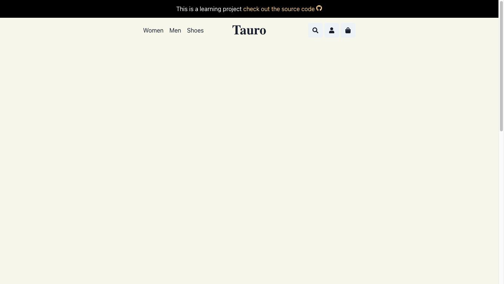

# Worked on Tauro's Banner

Hey there, this is an ecommerce site I am creating with the purpose of learning how to create a complex application using both frontend and backend technologies.
Today I worked on the site's header, it includes a heading in the center, a navigation on the left side and a menu on the right side.
It looks like this:

The **left menu** can be used to show products of certain category

The **right menu** has 3 different icons:

- Search: To search for an specific product
- Shopping bag: To open the shopping bag
- Login: To Authenticate (Admin Users should be able to add products, edit them and delete them)

Next Tasks:

- Create Product Cards
- Create Products List State
